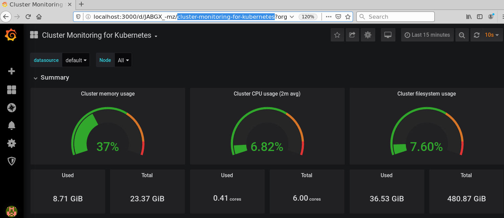
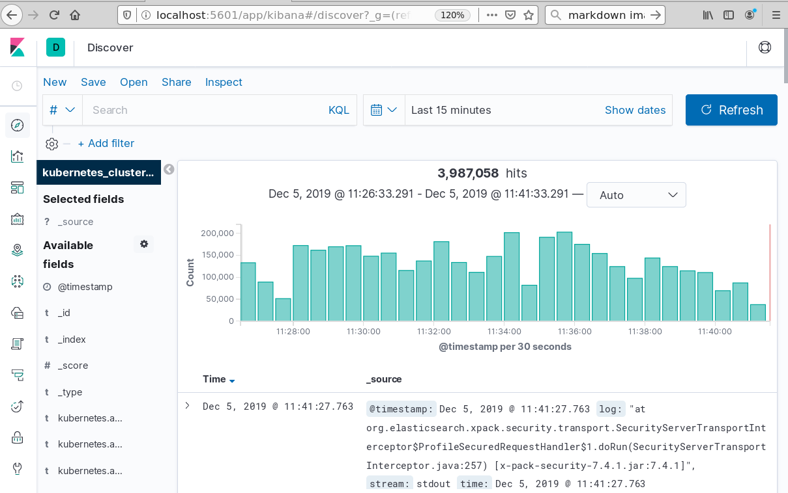
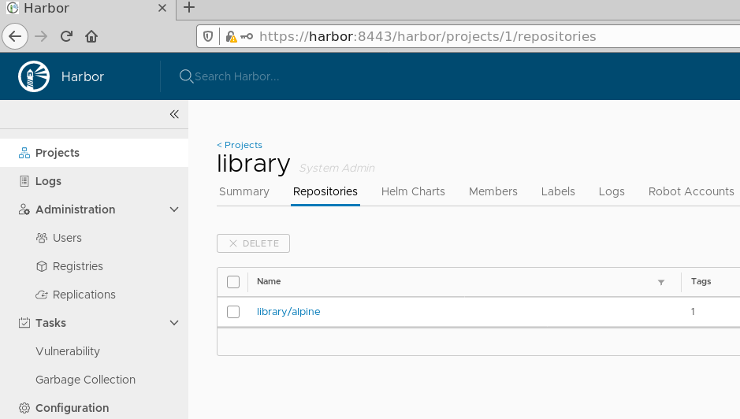
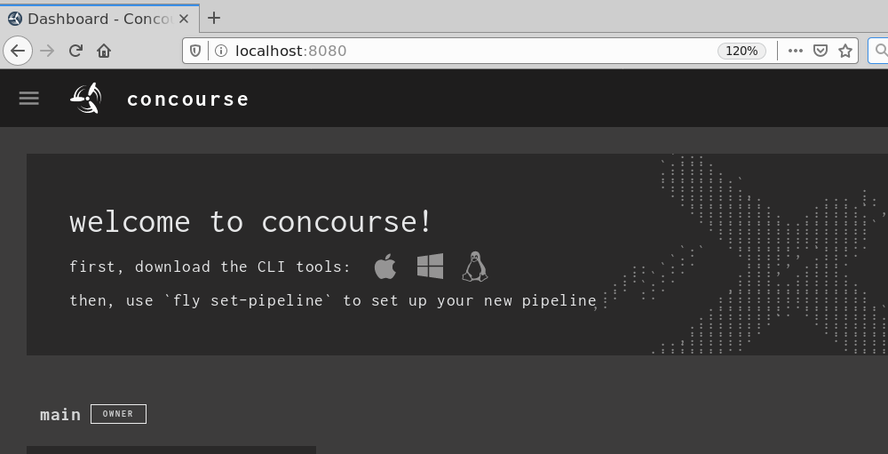
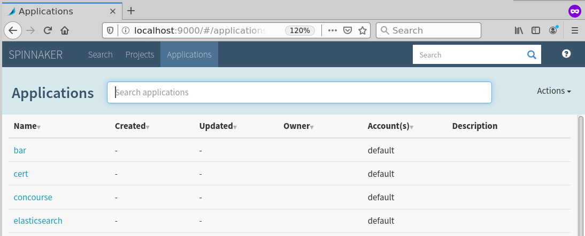

# Installing the default implementation of Platform Operations on Kubernetes

The default example installs components with their default authentication methods, because of this we do not expose services via `NodePort` or `LoadBalancer` and instead rely on the user running `kubectl port-forward`.

The following components are installed in the default environment:

* Grafana
* Prometheus
* Loki / Promtail
* Concourse
* Harbor
* Spinnaker
* Minio (for Spinnaker and Harbor artifacts)


## Create Kubernetes Cluster

If you don't already have a Kubernetes cluster you should use PKS or GKE to create one.

Wait for cluster to be ready...

Ensure kubectl is working

```bash
$ kubectl get nodes
NAME                                      STATUS   ROLES    AGE   VERSION
vm-5ca56981-6249-4d31-613e-7d84821b245e   Ready    <none>   46m   v1.13.5
vm-5fb78083-d502-43b3-4e01-d664fdb147dc   Ready    <none>   42m   v1.13.5
vm-b451253c-e485-4d99-7bb4-1cfe222bf4ac   Ready    <none>   39m   v1.13.5
```

## Prepare Helm

Download and Install [Helm 2](https://github.com/helm/helm/releases/tag/v2.15.2).

Install the helm diff and tillerless plugins:

```bash
helm init --client-only

helm plugin install https://github.com/databus23/helm-diff

helm plugin install https://github.com/rimusz/helm-tiller

helm tiller install
```


## Fill out envs.sh

If you want to customize your deployment copy the contents of `/envs/default` to another location and modify `envs.sh` and `values.yaml` accordingly.

If you're using PKS make sure you set the env variable `PKS=true`. This will help configure the correct paths etc for host mounts.

## Load environment

> Note: If you changed the location of your environment you'll need to modify this command.

```bash
. ./envs/default/envs.sh
```

## Install using helmfile

```bash
helmfile --state-values-file $ENV_DIR/values.yaml diff
```

## Check services

### Grafana

```bash
kubectl -n metrics port-forward svc/grafana 3000:80
```

Point your web browser at `http://localhost:3000` and then browse to the `cluster-monitoring-for-kubernetes` dashboard.



### Kibana

> Note: `sudo sysctl -w vm.max_map_count=262144` must be set on your worker nodes for elasticsearch to start correctly. Or you can enable privileged mode which is not recommended.

```bash
kubectl -n logging port-forward svc/kibana-kibana 5601
```

Use `curl` to set a default index pattern

```
curl -XPOST -H "Content-Type: application/json" -H "kbn-xsrf: true" localhost:5601/api/kibana/settings/defaultIndex -d '{"value": "kubernetes_cluster-*"}'
```

Point your web browser at `http://localhost:5601/app/kibana#/discover`



### Harbor

> Note: You should add an `/etc/hosts` record for `127.0.0.1 harbor`

Forward a port for harbor

```console
kubectl -n harbor port-forward svc/harbor 8443:443
```

Save harbor's CA cert to your local docker config:

```console
sudo su -
mkdir /etc/docker/certs.d/harbor
curl -k https://harbor:8443/api/systeminfo/getcert > /etc/docker/certs.d/harbor/ca.cert
```

Log into registry and push an image:

```console
$ docker login https://harbor:8443
Username: admin
Password: ******
Login Succeeded
```

```console
docker pull alpine:latest
docker tag alpine:latest harbor:8443/library/alpine:latest
docker push harbor:8443/library/alpine:latest
```

Browse to [http://harbor:8443](http://harbor:8443) in your web browser and login using `admin` and `change-me-please` (although you should have changed that password in envs.sh).

You should be able to see your recently pushed alpine image at [https://harbor:8443/harbor/projects/1/repositories](https://harbor:8443/harbor/projects/1/repositories).




### Concourse

Forward a port for concourse

```console
kubectl -n concourse port-forward svc/concourse-web 8080
```

Browse to [http://localhost:8080](http://localhost:8080) in your web browser and login using `admin` and `change-me-please` (although you should have changed that password in envs.sh).



### Spinnaker

Forward a port for Spinnaker

```console
kubectl -n spinnaker port-forward svc/spin-deck 9000
```

Browse to [http://localhost:9000](http://localhost:9000) in your web browser.


